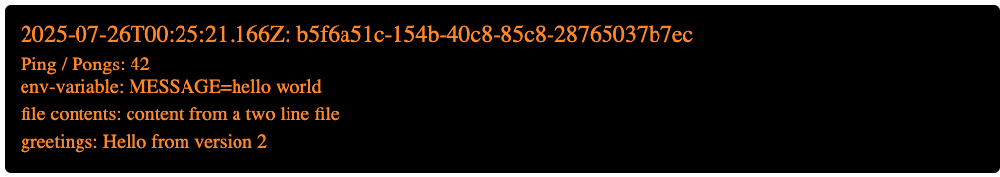

# 🚀 Exercise 5.3. Log app, the Service Mesh Edition

## 🎯 Project Goal

Deploy the Log to service mesh. Extend the app with a new service greeter that
responds with a HTTP GET request with a greeting (such as hello).

The implementation of the _greeter_ can be
found [here](../../pingpong-log-output/greeter)

Consequently, the hash-reader get the message and prints it in the page.

The manifests are consolidated in [this directory](./manifests)

After applying the manifest we can clearly se how the traffic is divided between
the two pod

The images show how the message changes:

 
