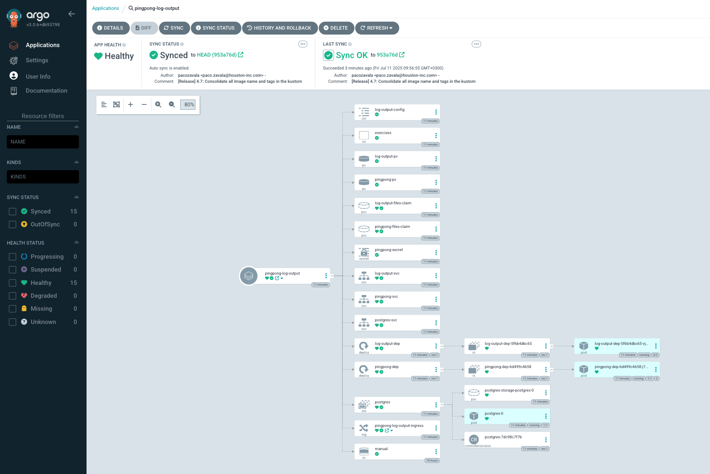
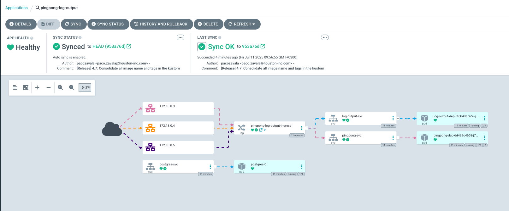
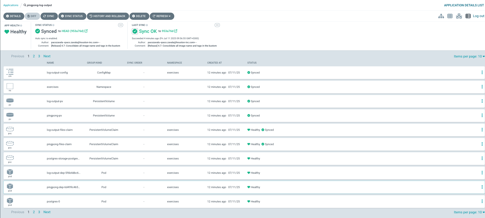

# 🚀 Exercise 4.7. Baby steps to GitOps

### Move the Log output application to use GitOps so that when you commit to the repository, the application is automatically updated.

## 🏓 1. Ping-pong Application

## 🚀 Goal

Create a local deployment using Argo CD as a tool and synchronize the repository
automatically for any changes.

---

## 🛠️ Implementation

## ✅ Deployment Summary

To achieve this, I avoided using
the [deployment script](deploy/scripts/deploy.sh) because Argo CD relies on
`kustomization.yaml` for application deployment. Running scripts through Argo CD
would require additional configurations and steps, which go against the
declarative GitOps workflow.

Nevertheless, the application was successfully deployed.

---

### 📦 Current Kubernetes Resources

```bash
➜  ~ kubectl get all -n exercises
NAME                                  READY   STATUS    RESTARTS      AGE
pod/log-output-dep-5f6b4dbc65-vjzm6   2/2     Running   0             25m
pod/pingpong-dep-6d499c4658-j7sl9     1/1     Running   2 (25m ago)   25m
pod/postgres-0                        1/1     Running   0             25m

NAME                     TYPE        CLUSTER-IP      EXTERNAL-IP   PORT(S)     AGE
service/log-output-svc   ClusterIP   10.43.197.106   <none>        30081/TCP   25m
service/pingpong-svc     ClusterIP   10.43.102.115   <none>        30081/TCP   25m
service/postgres-svc     ClusterIP   None            <none>        5432/TCP    25m

NAME                             READY   UP-TO-DATE   AVAILABLE   AGE
deployment.apps/log-output-dep   1/1     1            1           25m
deployment.apps/pingpong-dep     1/1     1            1           25m

NAME                                        DESIRED   CURRENT   READY   AGE
replicaset.apps/log-output-dep-5f6b4dbc65   1         1         1       25m
replicaset.apps/pingpong-dep-6d499c4658     1         1         1       25m

NAME                        READY   AGE
statefulset.apps/postgres   1/1     25m
```

The images below demonstrate the deployment outcome.






