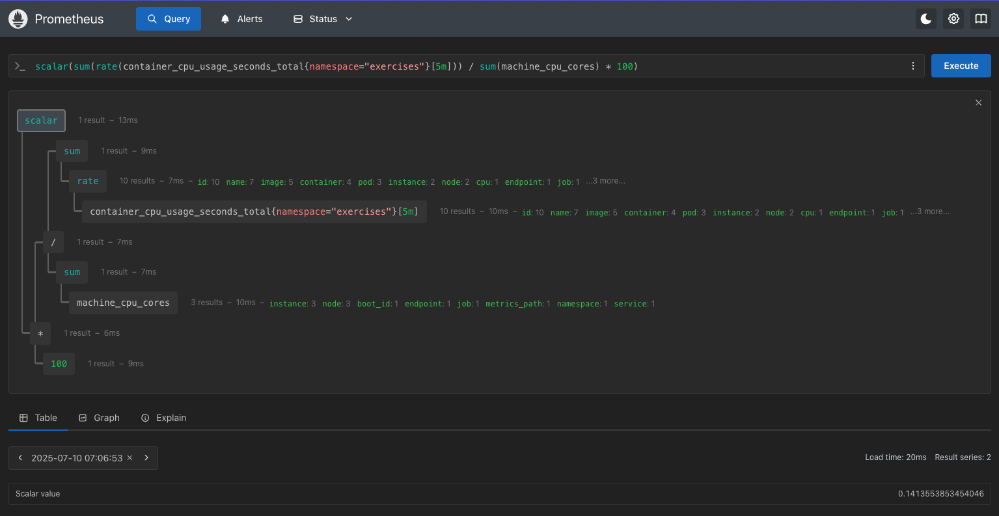

# 🚀 Exercise 4.4. Your canary

### Create an AnalysisTemplate for the Ping-pong app that will follow the CPU usage of all containers in the namespace. If the CPU usage rate sum for the namespace increases above a set value (you may choose a good hardcoded value) within 5 minutes, revert the update. Make sure that the application doesn't get updated, if the value is set too low.

## 🏓 1. Ping-pong Application

- **Goal**: The following the is the implementation of the template and what we
  could see in the Prometheus dashboard.

- **Implementation**:
  [analysisTemplate.yaml](deploy/kubernetes/base/analysisTemplate.yaml)

```yaml
apiVersion: argoproj.io/v1alpha1
kind: AnalysisTemplate
metadata:
  name: pingpong-cpu-usage-rate
spec:
  metrics:
    - name: cpu-usage-rate
      initialDelay: 4m
      # The analysis succeeds if the CPU usage rate is less than 2%.
      # If it's 2% or higher, the analysis fails, leading to a revert.
      successCondition: result < 2
      provider:
        prometheus:
          address: http://kube-prometheus-stack-1752-prometheus.prometheus:9090
          query: |
            scalar(sum(rate(container_cpu_usage_seconds_total{namespace="exercises"}[5m])) / sum(machine_cpu_cores) * 100) 
```

The image below reflects what the dashboard show when running the query in the
AnalysisTemplate manifest


