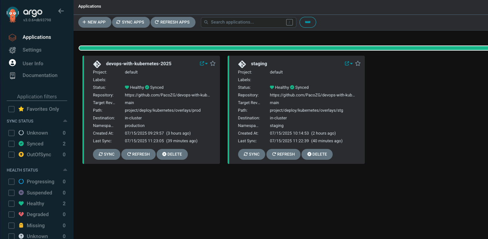
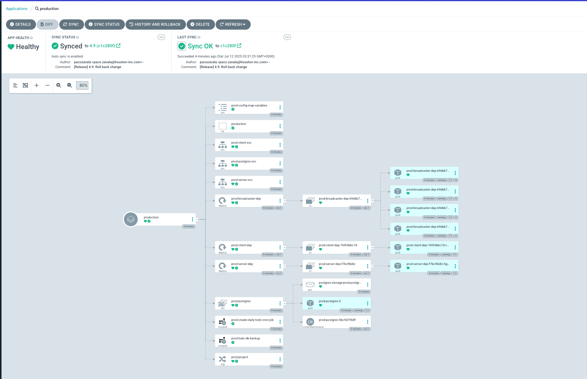
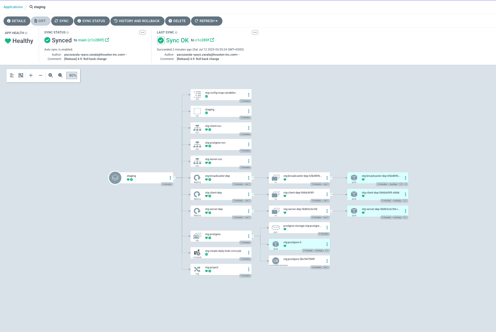

# 🚀 Exercise 4.9. The project, step 25

## 🏓 1. ToDo Application

## 🚀 Goal

Enhance the Project setup as follows

- Create two separate environments, production and staging that are in their own
  namespaces
- Each commit to the main branch should result in deployment to the staging
  environment
- Each tagged commit results in deployment to the production environment
- In staging the broadcaster just logs all the messages, it does not forward
  those to any external service
- In staging database is not backed up
- You may assume that secrets are readily applied outside of the ArgoCD

---

## 🛠️ Implementation

## ✅ Deployment Summary

In order to achieve making deployments to production I had to create a script
that will push tags with the latest
changes [deployment script](deploy/scripts/prod-dep.sh)

This is how the structure of the manifests has been done

```
deploy/kubernetes/
├── base/
│   ├── 00-broadcaster.yaml
│   ├── 01-postgres.yaml
│   ├── 02-server.yaml
│   ├── 03-client.yaml
│   ├── ... (other base manifests)
│   └── kustomization.yaml
└── overlays/
    ├── prod/
    │   ├── application.yaml  # ArgoCD App for prod
    │   ├── broadcaster.yaml  # Prod specific broadcaster (if needed)
    │   ├── kustomization.yaml # Prod kustomize overlay
    │   ├── ... (other prod specific manifests)
    └── stg/
        ├── application.yaml  # ArgoCD App for staging
        ├── kustomization.yaml # Staging kustomize overlay
        ├── ... (other stg specific manifests)
```

---

### 📦 We can see how bot environments are running without any issue:







We can clearly see that the latest revision in production is 4.9
