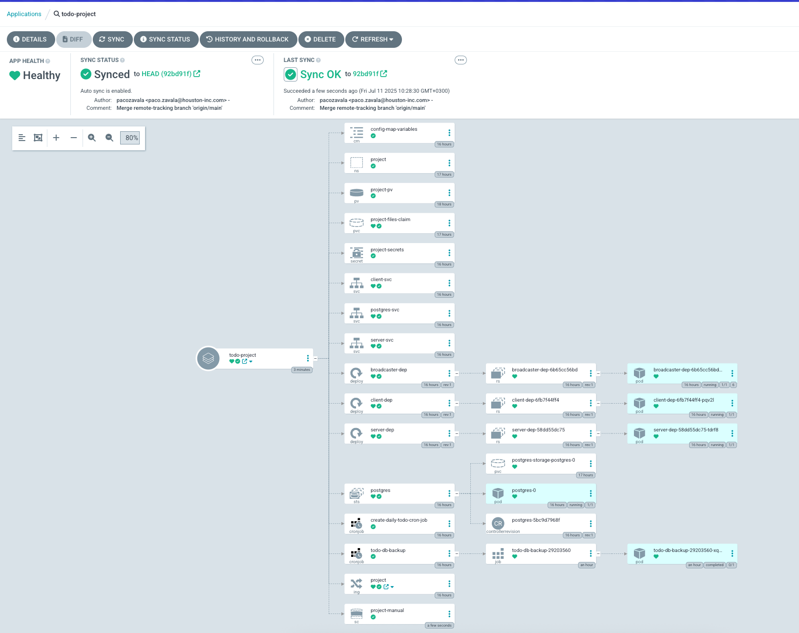
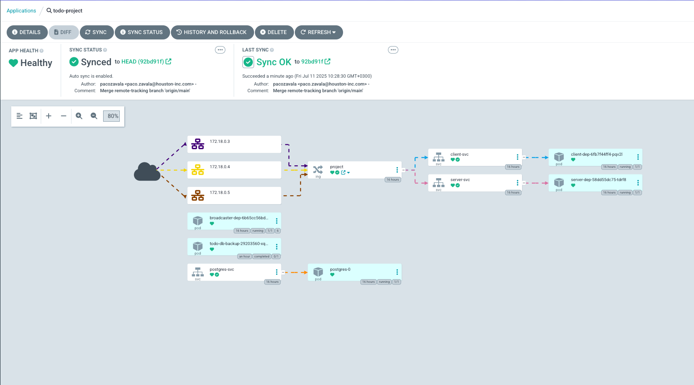
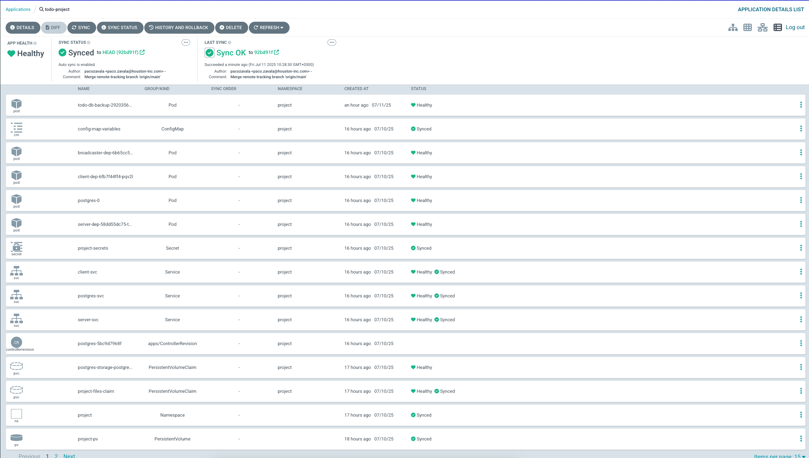

# 🚀 Exercise 4.8. The project, step 24

### Move the project to use GitOps so that when you commit to the repository, the application is automatically updated. In this exercise, it is enough that the main branch is deployed to cluster.

## 🏓 1. ToDo Application

## 🚀 Goal

Create a local deployment using Argo CD as a tool and synchronize the repository
automatically for any changes.

---

## 🛠️ Implementation

## ✅ Deployment Summary

Same as with the Pingpong application, to achieve this, I avoided using
the [deployment script](deploy/scripts/deploy-dev.sh) because Argo CD relies on
`kustomization.yaml` for application deployment. Running scripts through Argo CD
would require additional configurations and steps, which go against the
declarative GitOps workflow.

The application was successfully deployed.

---

### 📦 Current Kubernetes Resources

```
➜  ~ kubectl get all -n project
NAME                                   READY   STATUS      RESTARTS      AGE
pod/broadcaster-dep-6b65cc56bd-jmcxp   1/1     Running     6 (16h ago)   16h
pod/client-dep-6fb7f44ff4-pqv2l        1/1     Running     0             16h
pod/my-nats-0                          1/1     Running     0             17h
pod/my-nats-client                     1/1     Running     0             17h
pod/postgres-0                         1/1     Running     0             16h
pod/server-dep-58dd55dc75-tdrf8        1/1     Running     0             16h
pod/todo-db-backup-29203560-xqkc8      0/1     Completed   0             84m

NAME                       TYPE        CLUSTER-IP      EXTERNAL-IP   PORT(S)                      AGE
service/client-svc         NodePort    10.43.91.54     <none>        30081:32165/TCP              16h
service/my-nats            ClusterIP   10.43.60.61     <none>        4222/TCP,6222/TCP,8222/TCP   17h
service/my-nats-headless   ClusterIP   None            <none>        4222/TCP,6222/TCP,8222/TCP   17h
service/postgres-svc       ClusterIP   None            <none>        5432/TCP                     16h
service/server-svc         ClusterIP   10.43.202.216   <none>        30081/TCP                    16h

NAME                              READY   UP-TO-DATE   AVAILABLE   AGE
deployment.apps/broadcaster-dep   1/1     1            1           16h
deployment.apps/client-dep        1/1     1            1           16h
deployment.apps/server-dep        1/1     1            1           16h

NAME                                         DESIRED   CURRENT   READY   AGE
replicaset.apps/broadcaster-dep-6b65cc56bd   1         1         1       16h
replicaset.apps/client-dep-6fb7f44ff4        1         1         1       16h
replicaset.apps/server-dep-58dd55dc75        1         1         1       16h

NAME                        READY   AGE
statefulset.apps/my-nats    1/1     17h
statefulset.apps/postgres   1/1     16h

NAME                                       SCHEDULE    TIMEZONE   SUSPEND   ACTIVE   LAST SCHEDULE   AGE
cronjob.batch/create-daily-todo-cron-job   * 8 * * *   <none>     False     0        <none>          16h
cronjob.batch/todo-db-backup               0 6 * * *   <none>     False     0        94m             16h

NAME                                STATUS     COMPLETIONS   DURATION   AGE
job.batch/todo-db-backup-29203560   Complete   1/1           52s        84m
```

The images below demonstrate the deployment outcome.






