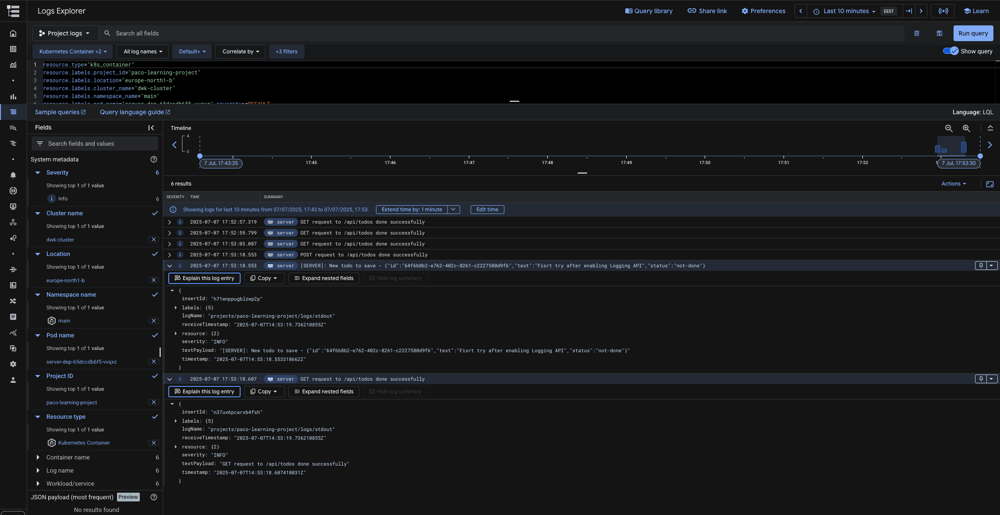

# Exercise 3.12. The project, step 20

#### GKE includes monitoring systems already so we can just enable the monitoring.

- Read documentation for Kubernetes Engine Monitoring here(opens in a new tab)
  and setup logging for the project in GKE. You can optionally include
  Prometheus as well. Submit a picture of the logs when a new todo is created.

## ✅ Enabling Logs in GCP for GKE Workloads

To start seeing container logs in **Google Cloud Logging (formerly Stackdriver)
** from my GKE cluster, I had to perform the following steps:

---

### 1. Enable the Cloud Logging API

Ensure the **Cloud Logging API** is enabled in your project:

📍 [Enable Cloud Logging API](https://console.cloud.google.com/apis/library/logging.googleapis.com)

---

### 2. Restart the Logging Daemon

After making changes to the cluster (e.g., enabling logging or adjusting
permissions), I manually restarted the **Fluent Bit logging agent** to apply the
changes:

```bash
  kubectl rollout restart daemonset fluentbit-gke -n kube-system
```

Wait for about 10 minutes for the pod to restart, I was able to see logs in GCP:


