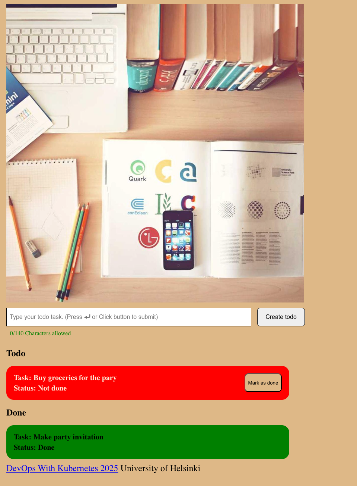

# Exercise 4.5. The project, step 22

#### Our todo application could use "Done" field for todos that are already done. It should be a PUT request to /todos/<id>.

After creating an endpoint for the backend to handle change on todo status:

```js
todoappRouter.patch('/:id', async (req, res) => {
  try {
    const { id } = req.params
    console.log(`[PATCH] /api/todos/${id} - Updating todo`)
    const updatedTodo = await updateTodo(id)
    res.status(200).json(updatedTodo)
  }
  catch (error) {
    console.error(`[ERROR] Updating todo with ID ${req.params.id}:`,
      error.message)
    res.status(404).json({ error: 'Todo not found' })
  }
})
```

in which `updateTodo` is a function that handles the update in the db

```js
import { pool } from './initDb.js'

const updateTodo = async id => {
  try {
    const todoToUpdate = await pool.query(`SELECT * FROM todos_table WHERE id = $1`,
      [id])

    if (!todoToUpdate) {
      console.log(`No todo found with ID: ${id}`)

      return null
    }

    const status = todoToUpdate.rows[0].status
    let newStatus

    if (status === 'not-done') {
      newStatus = 'done'
    } else if (status === 'done') {
      newStatus = 'not-done'
    }

    const updateTodo = await pool.query(`UPDATE todos_table SET status = $1 WHERE id = $2 RETURNING *`,
      [newStatus, id])

    return updateTodo.rows[0]
  }
  catch (error) {
    console.error(`Error toggling todo status for ID ${id}:`, error.message)

    return null
  }
}

export default updateTodo
```

and some change on the frontend of the application, the following is a
screenshot of how the application looks like in the browser.



