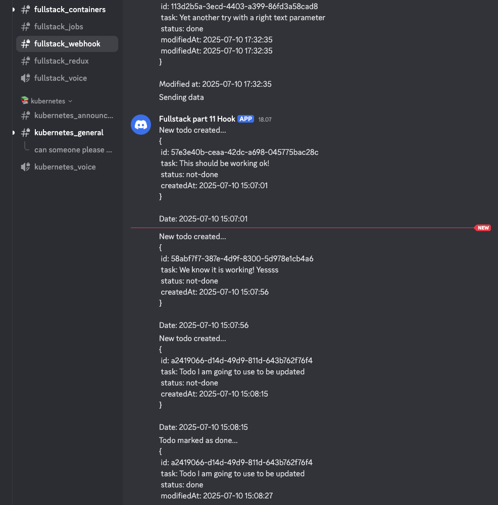

# Exercise 4.6. The project, step 23

#### Create a new separate service for sending status messages of the todos to a popular chat application. Let's call the new service "broadcaster".

📋 Requirements: Todo Change Broadcasting System

✅ Backend Responsibilities
• The backend must send a message to NATS when a todo is created or updated.
• The message should contain relevant details about the todo change (e.g.,
status, title, ID).

📡 Broadcaster Responsibilities
• The broadcaster service should subscribe to NATS messages.
• Upon receiving a message, it must forward it to an external service in a
supported format.

⸻

🌐 Supported External Services

You can choose either of the following as your broadcast target:
• Discord
You may use the course’s Full Stack Discord server.
See details here (update the link as needed).

⸻

🛠️ Next Step

After implementing an endpoint in the backend to handle changes in todo status,
make sure it:

1. Publishes a message to NATS.
2. Triggers the broadcaster to pick it up.
3. Successfully forwards the update to the external service.

Changes made to the Project server application:

```js
import { Router } from 'express'
import { v4 as uuidv4 } from 'uuid'
import getAllTodos from '../db/getAllTodos.js'
import storeTodo from '../db/storeTodo.js'
import getTodo from '../db/getTodo.js'
import updateTodo from '../db/updateTodo.js'
import { connect, StringCodec } from 'nats'
import { NATS_URL } from '../utils/appConfig.js'
import dayjs from 'dayjs'

const todoappRouter = Router()
const sc = StringCodec()

if (NATS_URL) {
  console.log({ NATS_URL })
  connect({ servers: NATS_URL }).then(async nc => {
    nc.publish('todo_created', sc.encode('Sending data'))
  })
} else {
  console.log('No NATS URL has been provided')
}

todoappRouter.get('/', async (req, res) => {
  try {
    console.log('[GET] /api/todos - Fetching all todos')
    const todos = await getAllTodos()
    res.status(200).json(todos)
  }
  catch (error) {
    console.error('[ERROR] Fetching all todos:', error.message)
    res.status(500).json({ error: 'Failed to fetch todos' })
  }
})

todoappRouter.get('/:id', async (req, res) => {
  try {
    const { id } = req.params
    console.log(`[GET] /api/todos/${id} - Fetching todo`)
    const todo = await getTodo(id)
    res.status(200).json(todo)
  }
  catch (error) {
    console.error(`[ERROR] Fetching todo with ID ${req.params.id}:`,
      error.message)
    res.status(404).json({ error: 'Todo not found' })
  }
})

todoappRouter.post('/', async (req, res) => {
  try {
    const { body } = req
    if (!body.text || body.text.length > 140) {
      return res.status(400)
        .json({ error: 'Text is required and must be 140 characters or less' })
    }

    const id = uuidv4()

    const newTodo = {
      id: id,
      text: body.text,
      status: 'not-done'
    }
    console.log('[POST] /api/todos - Creating new todo:', newTodo)

    const todos = await storeTodo(newTodo)
    const newDate = dayjs().format('YYYY-MM-DD HH:mm:ss')

    if (NATS_URL) {
      const todoForDiscord = `New todo created...\n{\n id: ${id}\n task: ${newTodo.text}\n status: ${
        newTodo.status
      }\n createdAt: ${newDate}\n}\n\nDate: ${dayjs().format(
        'YYYY-MM-DD HH:mm:ss')}`

      connect({ servers: NATS_URL }).then(async nc => {
        nc.publish('todo_created', sc.encode(todoForDiscord))
      })
    }

    res.status(201).json(todos)
  }
  catch (error) {
    console.error('[ERROR] Creating new todo:', error.message)
    res.status(500).json({ error: 'Failed to create todo' })
  }
})

todoappRouter.patch('/:id', async (req, res) => {
  try {
    const { id } = req.params
    console.log(`[PATCH] /api/todos/${id} - Updating todo`)
    const updatedTodo = await updateTodo(id)
    const newDate = dayjs().format('YYYY-MM-DD HH:mm:ss')

    if (NATS_URL) {
      const todoForDiscord = `Todo marked as ${updatedTodo.status}...\n{\n id: ${id}\n task: ${
        updatedTodo.text
      }\n status: ${updatedTodo.status}\n modifiedAt: ${dayjs(newDate).format(
        'YYYY-MM-DD HH:mm:ss')}`

      connect({ servers: NATS_URL }).then(async nc => {
        nc.publish('todo_created', sc.encode(todoForDiscord))
      })
    }

    res.status(200).json(updatedTodo)
  }
  catch (error) {
    console.error(`[ERROR] Updating todo with ID ${req.params.id}:`,
      error.message)
    res.status(404).json({ error: 'Todo not found' })
  }
})

export default todoappRouter

```

The Broadcaster application can be found [here](./broadcaster)

The k8s manifests can be found [here](deploy/kubernetes)

Below is an image that reflects how when creating of updating a todo a message
is sent to the Fullstack Webhook inm Discord




