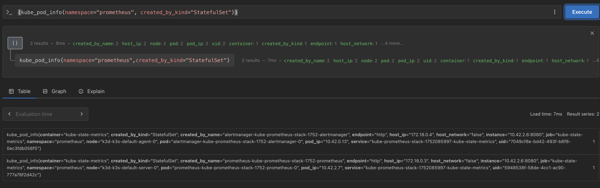
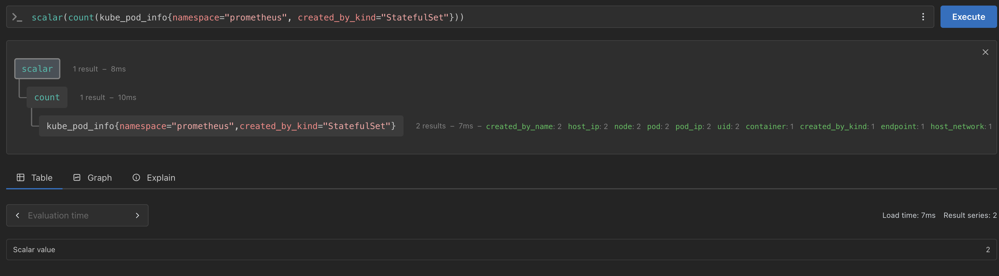
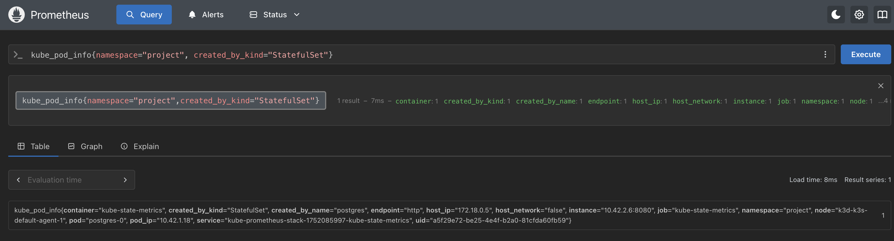

# Exercise 4.3. Prometheus

#### Write a query that shows the number of pods created by StatefulSets in prometheus namespace. For the above setup the Value should be 3 different pods

Case on which we only get the number of Statefulset

Case on which we query the information of those pods

___

### I tested also with the deployment of the `project`

We can clearly see in the table that it shows the postgress stateful

